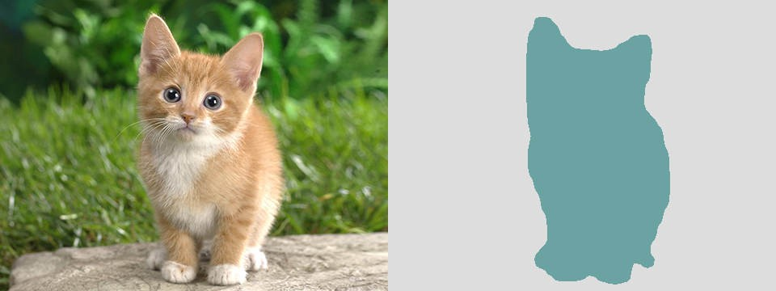

# The Segmentation Pipeline
## What is Segmentation?
It is the process of partitioning an image into multiple segments (sets of pixels, also known as image objects). The idea is to accuractely classify each and every pixel to one of the possible classes. 

## When do we need Segmentation?
When the task is to very accurately localise the object or defect of interest. While this is also a blackbox classifier and does not provide exact filters, it can build segmentation masks which exactly take on the shape of the object it is trying to locate. 
For example: 
#### Cat and dog semgentation module

#### Defect detection segmentation module


## Choice of models:
For ease of use, we have defined 6 models - S0, S1, S2, S3, S4, S5. 

S0 is the smallest and simplest model which will train the fastest but may not have very high accuracy. 
S5 is the largest and most complex. It will take some time to train but give a very high accuracy. 

If you have a simple dataset with uniform objects and less textures, start with S0 and move up if accuarcy is not satisfactory. If the dataset is complex, start with S4 and move up if accuracy is not satisfactory. 

## Annotation Details:
### Masks
If you have used any commonly avaibale tool to build the segmentation maps on your images and have exported the masks as separate images as showed in the figure, you can upload the images and the masks as separate folders to the system. 

The size of the image and map should also be the same. While most masks are *.png files, we also provide support for other formats. 

The image and the mask have to have the same name so that the software can map the images and their maps correctly. The images and their corresponding masks are stored in the folder structure shown below. 



## Folder structure to be followed:
For each image, there must be a corresponding mask with the same filename in the mask folder. 
```
Root
    |--- Train
    |   |--- Images
    |   |   |--- File1.jpg
    |   |   |--- File2.jpg
    |   |   |--- File3.jpg
    |   |   |--- ...
    |   |--- Masks
    |   |   |--- File1.png
    |   |   |--- File2.png
    |   |   |--- File3.png
    |   |   |--- ...
    |--- Evaluate
    |   |--- Images
    |   |   |--- File1.jpg
    |   |   |--- File2.jpg
    |   |   |--- File3.jpg
    |   |   |--- ...
    |   |--- Masks
    |   |   |--- File1.png
    |   |   |--- File2.png
    |   |   |--- File3.png
    |   |   |--- ...
    |--- Test
    |   |--- Images
    |   |   |--- File1.jpg
    |   |   |--- File2.jpg
    |   |   |--- File3.jpg
    |   |   |--- ...

```

## Function Definitions:
_* - required_
### 1. _semantic\_segmentation()_ constructor
The constructor is robust and can be used for creating a new model as well as loading existing models. 

Data folder should be a root folder containing _Images_ and _Masks_ folders as seen in the folder structure given below. 
#### Training from scratch: 
```python
semantic_segmentation(Model_Name*, Data_Path*,
                    img_extension, mask_extension,
                    Save_Path*, Image_Size)
```
#### Loading a pretrained model: 
```python 
semantic_segmentation(Path_to_Model*, Data_Path*,
                    img_extension, mask_extension,
                    Save_Path*, Image_Size)
```
#### Defaults:
```
Model Name: S0
Data Path: ./Data/Train/
Image Extension: *.jpg
Mask Extension: *.png
Save Path: ./Models/
Image Size: 256*256
```

### 2. _train()_ funciton:
This is a member function and is used to train the model. For most cases, start with 30 epochs. Based on loss and IoU, you can deicide to increase or decrese number of epochs. 

The system automatically splits the data into validation and train samples
```python
train(Number_of_Epochs*)
```

### 3. _evaluate()_ function: 
Member function to numerically evaluate the model. Scores reported are IoU, Dice and F2. Data path must include _Images_ and _Masks_ folders to ensure comparasion between prediction and ground truth can be made. 

Model must be trained or loaded before running evaluation to ensure accurate resuts. 

```python
evaluate(Path_to_Data*)
```
#### Defaults:
```
Path to Data: ./Data/Evaluate/
```

### 4. _predict()_ function:
A unified function for both file and folder testing. We will try and run the algorithm on all famous image formats found in the folder. The outputs are overlayed on the input image and stored in the output folder defined by you. Optionally, you can set a confidence threhsold to make the system mark objects that are as per your requirements.

Threshold defaults to 0.4 and output path defaults to _./Output/_

## Code Samples
The complete example code is provided in [Example.py](./Example.py)

#### Folder testing
```python
predict(*Path/to/Folder/, *Output/Path, Threshold)
``` 
#### File testing
```python
predict(*Path/to/File.jpg, *Output/Path, Threshold)
```
#### Defaults:
```
Output Path: ./Output/
Threshold: 0.4
```

## Acknowledgements
