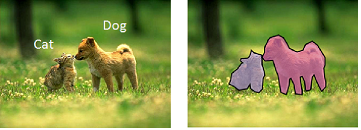
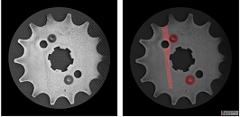
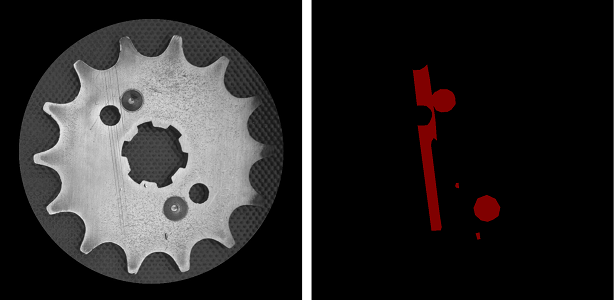

# The Segmentation Pipeline
## What is Segmentation?
It is the process of partitioning an image into multiple segments (sets of pixels, also known as image objects). The idea is to accuractely classify each and every pixel to one of the possible classes. 

## When do we need Segmentation?
When the task is to very accurately localise the object or defect of interest. While this is also a blackbox classifier and does not provide exact filters, it can build segmentation masks which exactly take on the shape of the object it is trying to locate. 
For example: 
#### Cat and dog semgentation module

#### Defect detection segmentation module


## Choice of models:
For ease of use, we have defined 6 models - S0, S1, S2, S3, S4, S5. 

S0 is the smallest and simplest model which will train the fastest but may not have very high accuracy. 
S5 is the largest and most complex. It will take some time to train but give a very high accuracy. 

If you have a simple dataset with uniform objects and less textures, start with S0 and move up if accuarcy is not satisfactory. If the dataset is complex, start with S4 and move up if accuracy is not satisfactory. 

## Preprocessing: 
To ensure higher accuracy, the system carries out basic preprocessing and image augmentation. If required, the user can take control and set the following parameters:
```python
shear_range - 0-1, Default = 0
zoom_range - 0-1, Default = 0
horizontal_flip - True/False, Default = True
vertical_flip - True/False, Default = True
rotation_range - 0-360 degrees, Default = 10
width_shift_range - 0-1, Default = 0
height_shift_range - 0-1, Default = 0
```
## Annotation options:
### Masks
If you have used any commonly avaibale tool to build the segmentation maps on your images and have exported the masks as separate images as showed in the figure, you can upload the images and the masks as separate folders to the system. Make sure the name of the image and the mask are the same so that the mask for the corresponidng image can be correctly loaded. 
The size of the image and map should also be the same. While most masks are *.png files, we also provide support for other formats. 



### Annotation tool
The other option is to use the provided annotation tool to manually make/add polygon maps to the image in question. This tool can be used on non annotated images as well as previosuly annotated images in case changes need to be made. 

## Folder structure to be followed:
For each image *.jpg, there must be a corresponding mask with the same filename in the mask folder. 
```
Root
    |--- Images
    |   |--- File1.jpg
    |   |--- File2.jpg
    |   |--- File3.jpg
    |   |--- ...
    |--- Masks
    |   |--- File1.png
    |   |--- File2.png
    |   |--- File3.png
    |   |--- ...
```